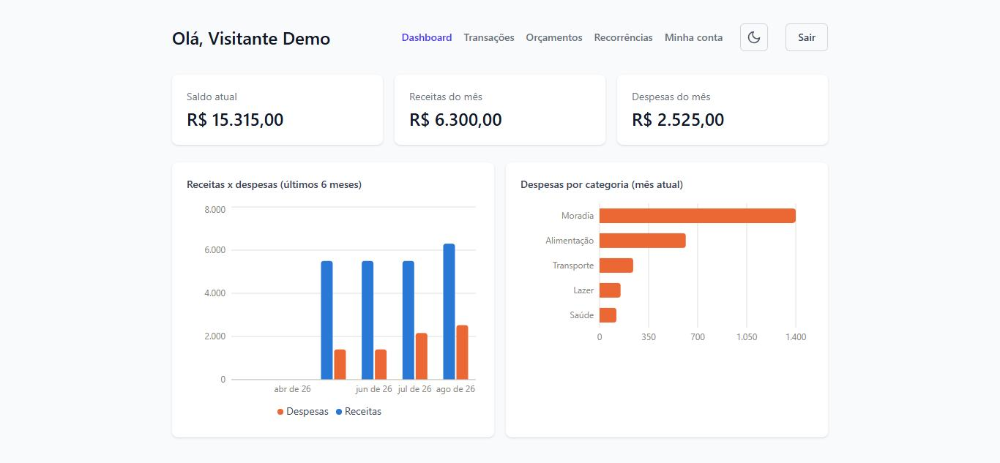
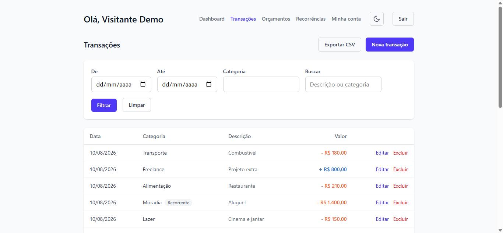
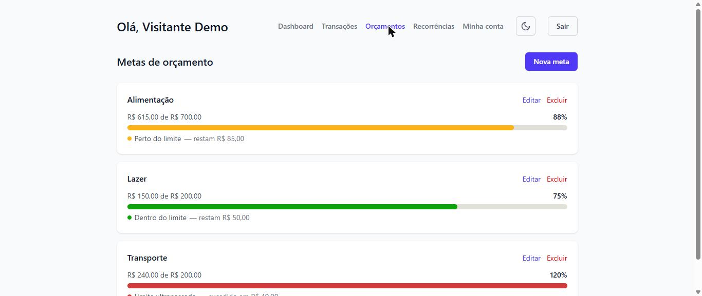
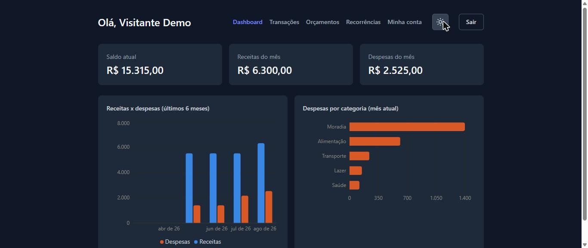

# FinTrack

Gerenciador de finanças pessoais full-stack — controle de receitas e despesas, metas de orçamento por categoria, transações recorrentes, gráficos e exportação de dados. Construído como projeto de portfólio, com padrão de qualidade de produção (deploy real, testes automatizados, histórico de commits/PRs organizado).

**🔗 Demo ao vivo:** [www.myfintrack.com.br](https://www.myfintrack.com.br)
Clique em **"Entrar como visitante"** na tela de login para explorar o app com dados já populados, sem precisar criar conta.



## Funcionalidades

- **Autenticação** com JWT (registro, login, recuperação de senha por e-mail, exclusão de conta)
- **Transações**: CRUD completo de receitas/despesas, busca por texto, filtros por período/categoria, paginação
- **Dashboard**: saldo atual, resumo do mês, gráfico de receitas x despesas (6 meses) e despesas por categoria
- **Metas de orçamento**: limite mensal recorrente por categoria, com barra de progresso (verde/amarelo/vermelho)
- **Transações recorrentes**: templates (salário, aluguel, etc.) que geram lançamentos automaticamente
- **Exportação CSV** das transações, respeitando os filtros aplicados
- **Modo escuro**, com preferência salva e detecção automática do tema do sistema
- **Layout responsivo** (mobile/tablet/desktop)
- **Login como visitante**, para avaliação sem cadastro

## Stack

| Camada | Tecnologias |
|---|---|
| Frontend | React 19 (Vite), Tailwind CSS v4, React Router, Recharts, Axios |
| Backend | Node.js, Express, arquitetura por módulos (schema/service/controller/routes) |
| Banco de dados | PostgreSQL + Prisma ORM |
| Autenticação | JWT (Bearer token) |
| E-mail transacional | Resend |
| Testes | Playwright (E2E) |
| Deploy | Vercel (frontend) + Railway (backend + Postgres) |

## Testes

Suíte E2E com [Playwright](e2e/) cobrindo os fluxos críticos ponta a ponta (autenticação, CRUD de transações, metas de orçamento) contra o frontend, backend e banco reais. Ver [`e2e/README.md`](e2e/README.md) para instruções de execução.

## Rodando localmente

Pré-requisitos: Node 20+, Docker (ou um Postgres local).

```bash
# 1. Suba o Postgres local
docker compose up -d

# 2. Backend
cd backend
cp .env.example .env   # ajuste as variáveis se necessário
npm install
npm run dev             # http://localhost:3333

# 3. Frontend (em outro terminal)
cd frontend
npm install
npm run dev              # http://localhost:5173
```

## Mais telas

<table>
  <tr>
    <td></td>
    <td></td>
  </tr>
  <tr>
    <td></td>
  </tr>
</table>

## Estrutura do repositório

```
FinTrack/
├── backend/   # API Express + Prisma
├── frontend/  # SPA React (Vite)
├── e2e/       # Testes end-to-end (Playwright)
└── docs/      # Screenshots e material de apoio
```

---

Desenvolvido por [Lucas Pereira de Lima](https://github.com/LucasDevRJ).
